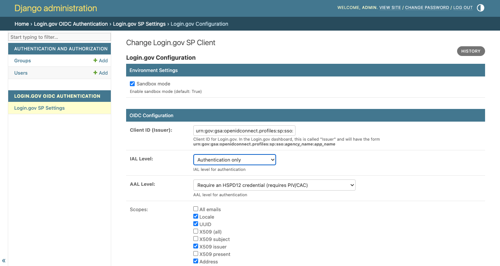
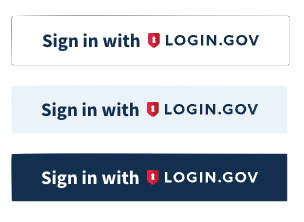

# Django Login.gov Integration

[](https://badge.fury.io/py/django-logingov)
[](https://github.com/sentaidigital/django-logingov/blob/main/LICENSE)

A Django app that provides a seamless integration with Login.gov for authentication.

## Overview

The `django-logingov` app makes it easy to integrate Login.gov authentication into your Django project. It provides a complete solution for handling Login.gov's OpenID Connect flow, including user creation and linking, customizable login buttons, and admin configuration.

## Features

- **Complete Login.gov Integration**: Full OpenID Connect implementation with up-to-date support for all current Login.gov authentication levels (IAL and AAL)
- **User Management**: Automatically create and link Django users to Login.gov accounts and set a default group
- **Customizable Login Buttons**: Templatetags that generate the standard Login.gov buttons according to [Login.gov User Experience guidelines](https://developers.login.gov/user-experience/sign-in-sign-out/)
- **Admin Configuration**: Easy-to-use Django admin interface for setting up Login.gov service provider settings
- **Multi-language Support**: Translations for English, French, Spanish, and Japanese
- **Sandbox and Production Modes**: Toggle between Login.gov sandbox and production environments
- **Flexible Scopes**: Configure which user information to request from Login.gov
- **USWDS Compatible**: Works with the USWDS design system for consistent button styling

## UI Screenshots

### Admin Interface


*The Django admin interface provides a user-friendly way to manage Login.gov service provider settings.*

### Login Buttons


*The templatetags create standard Login.gov buttons that follow the [Login.gov User Experience guidelines](https://developers.login.gov/user-experience/sign-in-sign-out/).*

## Quickstart

1. Install the package:
```bash
pip install django-logingov
```

2. Add to your Django settings:

```python
INSTALLED_APPS = [
    ...
    'logingov',
]

MIDDLEWARE = [
    ...
    'django.contrib.sessions.middleware.SessionMiddleware',
    'django.contrib.auth.middleware.AuthenticationMiddleware',
    ...
]

# Static files configuration (required for the login button CSS)
STATIC_URL = 'static/'
STATICFILES_DIRS = [
    BASE_DIR / "static",
]
```

3. Add the URLs to your root `urls.py`:

```python
from django.urls import path, include

urlpatterns = [
    ...
    path("logingov/", include("logingov.urls")),
    ...
]
```

4. Run migrations:

```bash
python manage.py migrate
```

5. Visit your project's administration section to configure Login.gov settings.

See the [INSTALL.md](docs/INSTALL.md) for more detailed setup instructions.

## Requirements

- Django 5.2+
- Python 3.12+

## License

This project is licensed under the BSD license - see the [LICENSE](LICENSE) file for details.

## Support

For questions, support, or to report a bug, please open an issue on the [GitHub repository](https://github.com/sentaidigital/django-logingov/issues).

Patches are welcome!  To contribute to the project, please submit a PR on
GitHub linked to an issue.
